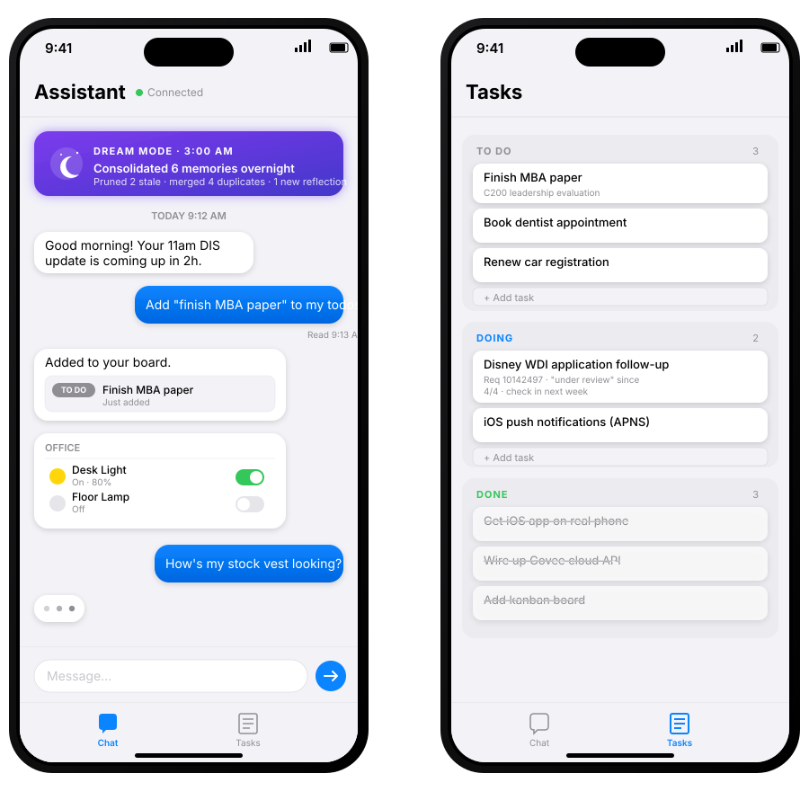

# AI Assistant

A **proactive** personal agent that checks in with you on its own schedule. Instead of waiting passively for commands, it periodically evaluates whether there's anything worth doing — reviewing what you've been working on, its long-term memory, the time of day, and your location — and acts through a suite of MCP tools. Every night it **dreams**: a separate reflective pass that reviews the day's conversations, prunes stale memories, consolidates duplicates, and writes a reflection to long-term memory.

Talk to it through a SwiftUI iOS app or an iMessage-style web chat.

<p align="center">
  
  <br><em>Rough mockup of the iOS app</em>
</p>

## What it does

- **Runs on a schedule.** Every few minutes the agent wakes up with a prompt like "Anything worth doing?" and decides whether to act, ask a question, or stay quiet.
- **Dreams nightly.** A daily reflection pass (at 3 AM by default) reviews the day's messages, reads the task board for context, prunes outdated memories, consolidates duplicates, and writes a summary of what happened and what to watch for tomorrow. Uses a separately-configurable model since it needs more context than a tick.
- **Remembers things long-term.** Memories are pinnable (always included in every prompt), soft-deletable with restore, in-place editable for minor fixes, and categorizable. Pinned memories are injected into the system prompt so they participate in prompt caching across ticks.
- **Manages a kanban board.** To Do / Doing / Done columns for tracking what you're working on. The agent can add, move, and close tasks for you via chat, and you can drag cards around manually from web or iOS. Dream mode reads the board for context but can't mutate it.
- **Chats with you.** Real-time WebSocket messaging with typing indicators, read receipts, multiple-choice prompts, and link previews, rendered as native bubbles on iOS **and** as an iMessage-style web chat.
- **Schedules callbacks.** The agent can tell itself "wake me up in 2 hours and remind the user about X" and it'll fire on its own.
- **Pulls live data.** Web search, web-page fetch, current time/date, user location (requested from the iOS device over WebSocket), and message history.
- **Controls your smart home.** Unified control over Govee (cloud) and TP-Link Kasa (LAN) devices — lights, plugs, light strips — as one use case among many.

## Architecture

This is a monorepo with three packages.

### `backend/` — TypeScript agent service
The brains. A Hono HTTP server with a WebSocket endpoint, a SQLite database, an MCP server exposing 30+ tools, and a scheduler that invokes the Claude Agent SDK on a cron-like loop.

- **`index.ts`** — Hono server, WebSocket hub, agent loop bootstrap
- **`agent.ts`** — The `query()` loop against `@anthropic-ai/claude-agent-sdk`, system prompts, scheduling
- **`mcp.ts`** — MCP server with user-facing tools (ask_question, send_message, memories, callbacks, etc.)
- **`smarthome.ts`** — Unified smart-home MCP tools + scene engine
- **`govee.ts`** — Govee cloud API v2 client
- **`kasa.ts`** — LAN discovery + control for TP-Link Kasa devices
- **`db.ts`** — SQLite schema, migrations, CRUD
- **`ws.ts`** — WebSocket broadcast + event types

### `ios/` — Native SwiftUI app
Targets iOS 18+. Acts as both the chat UI **and** a tool provider — the backend can ask the iOS app for the user's location over WebSocket and the app will respond with CoreLocation data.

- **Chat tab**: markdown-free bubbles, typing indicators, read receipts, link previews, multiple-choice prompts, smart-home cards with live WebSocket-driven state updates
- **Tasks tab**: kanban board with 3 stacked columns, per-task menu (move/edit/delete), add-task field, edit sheet
- Local notifications when messages arrive in the background
- `Config.swift` (gitignored) for backend URLs — see setup below

### `web/` — React dashboard, chat, and kanban
A React 19 + Vite + Tailwind v4 app with three tabs:

- **Chat**: iMessage-style web chat matching the iOS app, plus a kanban side panel for tasks (drag-and-drop between columns, inline editing, live WebSocket updates)
- **Agent Debug**: system/dream prompt editors, per-prompt-type model selectors (tick vs. dream), memories browser with category filter + soft-delete toggle + restore, scheduled callbacks, live tool-call log with markdown rendering for dream reflections
- **Smart Home**: Kasa LAN discovery, Govee cloud sync, room assignment, live state display, settings panel for API keys

## Tech Stack

- **Backend**: TypeScript, Hono, `@hono/node-ws`, better-sqlite3, `@anthropic-ai/claude-agent-sdk`, `@modelcontextprotocol/sdk`, zod
- **iOS**: SwiftUI, CoreLocation, UserNotifications, URLSessionWebSocketTask
- **Web**: React 19, Vite, Tailwind v4, TypeScript
- **Smart home**: Govee cloud API v2, `tplink-smarthome-api` (LAN)

## MCP Tools

The agent has access to a rich tool surface, all exposed through an in-process MCP server via `InMemoryTransport`:

| Category | Tools |
|---|---|
| Communication | `send_message`, `ask_question`, `ask_multiple_choice` |
| User context | `get_location`, `get_messages`, `get_current_time` |
| Memory | `remember`, `recall`, `forget`, `edit_memory`, `pin_memory`, `unpin_memory` |
| Tasks (kanban) | `list_tasks`, `add_task`, `update_task`, `delete_task` |
| Scheduling | `schedule_callback` |
| Web | `web_search`, `web_fetch` |
| Smart home (unified) | `get_lights`, `set_light`, `set_lights`, `set_room`, `show_devices`, `get_all_devices`, `sync_devices` |
| Smart home (other) | `get_thermostat`, `set_thermostat`, `get_locks`, `set_lock`, `get_sensors`, `get_scenes`, `activate_scene` |

Smart-home tools are source-agnostic: a light ID like `govee:H6008:ABCD...` or `kasa:ABC123` is routed automatically to the right backend.

Some tools are **gated by prompt type**. The tick agent cannot call `edit_memory` (force it through `forget` + `remember` instead), and dream mode is **read-only** against the task board — it can `list_tasks` for context but cannot add/update/delete tasks. These gates are enforced via `disallowedTools` on the Agent SDK query, not just prompt wording.

## Setup

### Backend

```sh
npm install
npm run dev
```

The backend starts on port 8136 by default. Set `PORT` to override.

**API keys** (optional, set via the web dashboard's Settings panel or directly in the `settings` table):
- `govee_api_key` — from [developer.govee.com](https://developer.govee.com)
- `anthropic_api_key` — **not required** if using Claude Code's Max subscription
- `tavily_api_key` — for `web_search` tool

### Web Dashboard

```sh
npm run dev:web
# or npm run dev to start both backend + web
```

Dashboard runs on Vite's default port (usually 5173).

### iOS App

1. Copy the config template:
   ```sh
   cp ios/AIAssistant/Config.example.swift ios/AIAssistant/Config.swift
   ```
2. Edit `Config.swift` with your backend URL (e.g. `https://your-tunnel.example.com` and `wss://your-tunnel.example.com/ws`). This file is gitignored.
3. Open `ios/AIAssistant.xcodeproj` in Xcode.
4. Build and run on simulator or device.

For remote access from a real device, expose the backend via a tunnel (Cloudflare Tunnel, ngrok, Tailscale, etc.).

## Database Safety

**Never delete `data/assistant.db`.** It holds room assignments, device caches, memories, conversation history, API keys, and settings — months of accumulated state.

Schema changes go through the `migrations` array in `backend/src/db.ts`, using `CREATE TABLE IF NOT EXISTS` and `ALTER TABLE ADD COLUMN` statements. These are idempotent and safe to run on existing databases.

Before any risky change:
```sh
cp data/assistant.db "data/assistant.db.backup-$(date +%Y%m%d-%H%M%S)"
```

## API Reference

### REST
- `GET  /health` — health check
- `GET  /api/messages` — fetch recent messages
- `POST /api/messages` — send a user message `{ content }`
- `GET  /api/location` — last known user location
- `POST /api/location` — update location `{ latitude, longitude }`
- `GET  /api/smarthome/state` — unified smart-home snapshot
- `PUT  /api/smarthome/lights/:id` — control a light
- `PUT  /api/smarthome/devices/:id/room` — assign a device to a room
- `DELETE /api/smarthome/devices/:id` — remove a device from the cache
- `POST /api/kasa/devices/discover` — run LAN discovery
- `POST /api/govee/sync` — sync from Govee cloud
- `GET  /api/tasks` — list kanban tasks (optional `?status=todo|doing|done`)
- `POST /api/tasks` — create a task `{ title, description?, status? }`
- `PUT  /api/tasks/:id` — update title/description/status/sortOrder
- `DELETE /api/tasks/:id` — delete a task
- `GET  /api/agent/memories` — list memories (optional `?includeDeleted=true`)
- `POST /api/agent/memories/:id/restore` — undo a soft-delete
- `GET/PUT /api/agent/config` — agent interval, system/dream prompts, per-type models

### WebSocket
`GET /ws` — bidirectional JSON messages. Event types:
- `Message` — assistant/user chat message
- `typing` — `{ event: "typing", typing: bool }`
- `read` — `{ event: "read", messageIds: [...] }`
- `device_state_update` — live device state push
- `device_control` — client → server control command
- `request_location` / `location_response` — backend requests location, iOS responds
- `task_updated` — live task create/update push
- `task_deleted` — live task delete push

## Commands

```sh
npm run dev           # Backend + web dashboard, concurrently
npm run dev:backend   # Backend only (nodemon, 10s debounce)
npm run dev:web       # Web dashboard only
npm run build         # tsc compile
npm start             # Run compiled backend
```

## Roadmap

**Coming soon — new MCP integrations.** The agent is designed to pull in more of the user's digital life as read-only context and light-touch action surfaces:

- **Amazon MCP** — track orders, deliveries, and returns; surface "arriving today" in the morning check-in, notice delays, link deliveries to tasks
- **Calendar MCP** — read upcoming events so the agent can plan around meetings, respect focus blocks, and suggest timing for callbacks
- **GitHub MCP** — PR reviews pending, CI failures, issues assigned to the user, stale branches — fed into morning check-ins and reflected on during dream mode
- **Email MCP** — triage important mail, summarize threads, surface unreplied messages (read-only at first — sending requires explicit confirmation)

**Also planned:**

- **APNS push notifications** — currently uses local notifications; need a `.p8` key and `POST /api/devices/register` for real push.
- **Publish to App Store** — the iOS app is ready but needs packaging.
- **Voice I/O** — the agent is text-only for now.

## License

Personal project, no license yet.
